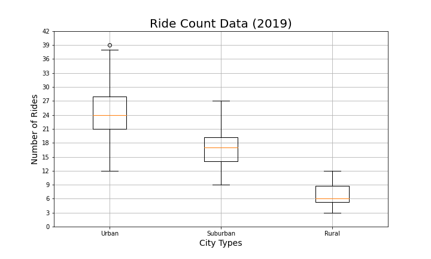
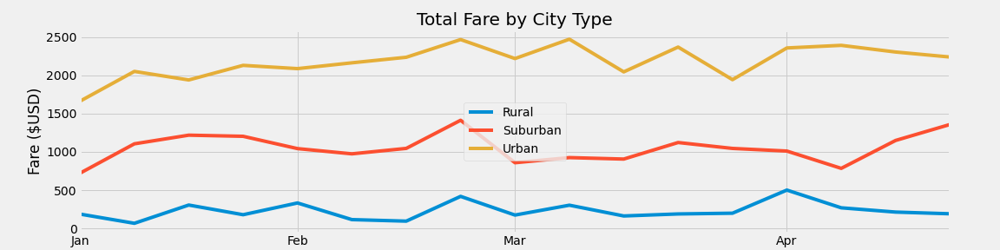

# PyBer_Analysis

## Project Overview

## Results 

## Summary 

In conclusion, the data team has the following recommendations for addressing disparities among the three city types:
 1.
 2. 
 3.

[For a look at this project's Jupyter Notebook, please click here.](https://github.com/r3ginam/PyBer_Analysis/blob/main/PyBer_Challenge.ipynb)
